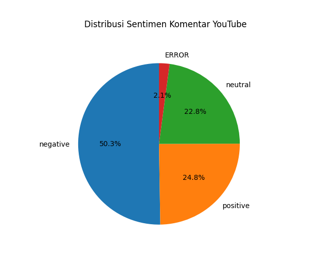
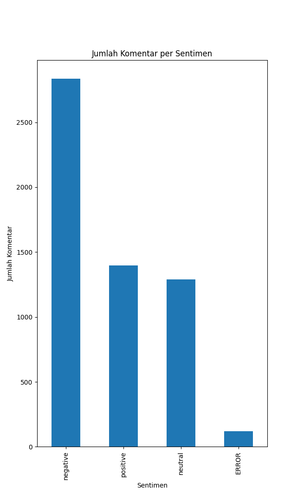

# Analisis Sentimen Komentar YouTube

Proyek ini merupakan **analisis sentimen komentar YouTube** menggunakan **Artificial Intelligence (Natural Language Processing)**.  
Tujuan utama proyek ini adalah untuk mengklasifikasikan komentar publik menjadi **positif, netral, dan negatif** agar mudah dipahami oleh orang awam.

---

## 🎯 Tujuan Proyek
- Mengambil data komentar YouTube secara otomatis
- Membersihkan dan memproses teks komentar
- Menganalisis sentimen menggunakan model AI Bahasa Indonesia
- Menyajikan hasil dalam bentuk visualisasi yang mudah dipahami

---

## 📊 Dataset
- Sumber data: Komentar YouTube
- Bahasa: Bahasa Indonesia
- Data diambil menggunakan **YouTube Data API**
- Data diproses dalam format CSV

---

## 🧠 Metodologi
Tahapan yang dilakukan dalam proyek ini:

1. **Data Collection**  
   Mengambil komentar YouTube menggunakan YouTube Data API.

2. **Preprocessing Teks**  
   - Mengubah teks menjadi huruf kecil  
   - Menghapus URL, emoji, simbol, dan karakter tidak penting  
   - Membersihkan spasi berlebih  

3. **Analisis Sentimen (AI)**  
   - Menggunakan model **Transformer (RoBERTa Bahasa Indonesia)**  
   - Setiap komentar diklasifikasikan menjadi:
     - Positif
     - Netral
     - Negatif

4. **Visualisasi Data**  
   Hasil analisis divisualisasikan agar mudah dipahami oleh pengguna non-teknis.

---

## 📈 Hasil Analisis

### Distribusi Sentimen Komentar
Grafik pie di bawah ini menunjukkan **persentase sentimen komentar** dari keseluruhan data.

---

### Jumlah Komentar per Sentimen
Grafik batang berikut menampilkan **jumlah komentar** untuk setiap kategori sentimen.

---

## 📝 Insight Singkat
Berdasarkan hasil analisis:
- Sentimen negatif mendominasi komentar, menunjukkan respons publik yang kritis
- Sentimen netral cukup signifikan, menandakan sebagian audiens melihat konten sebagai hiburan atau diskusi biasa
- Sentimen positif tetap ada, menunjukkan dukungan dari sebagian penonton

---

## 🛠️ Teknologi yang Digunakan
- Python
- Pandas
- HuggingFace Transformers
- TensorFlow / tf-keras
- Matplotlib
- YouTube Data API

---

## 📂 Struktur Proyek
